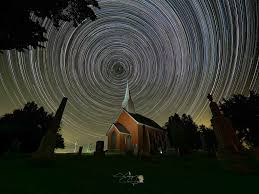

# Introduction

The Olympus OM-1 Mark II is the latest micro four-thirds flagship from OM System, designed to excel in fast action, high-resolution imagery—and it turns out to be a surprisingly capable astrophotography tool. In this post, we’ll explore how the OM-1 Mark II’s sensor, stabilization system, and specialized modes can help you capture night skies, milky way panoramas, and star trails with professional results.

# Sensor and ISO Performance

- **Stacked CMOS Sensor (20 MP):** Fast readout minimizes rolling shutter and enables high-speed bursts—useful for capturing meteors or lightning storms.
- **Native ISO 64–25,600 (Expandable to 102,400):** Low-noise performance at base ISO 64 translates to cleaner wide-field sky shots.
- **High-Speed Live View:** Zero blackout at up to 120 fps allows you to frame and focus on bright stars or satellites in real time.

# In-Body Image Stabilization (IBIS) for Sky Tracking

One of the OM-1 Mark II’s headline features is its 8 stops of 5-axis IBIS. When paired with the optional OM System OM-Track smartphone app, you can:

1. Mount the camera on a standard tripod.
2. Calibrate star tracking via your phone’s sensors.
3. Enable “Starry Sky AF” to engage IBIS as a makeshift equatorial tracker.

This method delivers pinpoint stars in exposures up to 2 minutes without a dedicated mount, making wide-field panoramas and time-lapses more accessible.

# Specialized Astrophotography Modes

OM System has included two in-camera modes tailored for night-sky enthusiasts:

- **Live Composite:** Automatically blends successive long exposures (up to 30 minutes each), ideal for light painting and star trails without overexposing the background.
- **Live Time:** The shutter remains open as long as you hold it—monitor histogram and highlights on the EVF, then close the shutter when you reach optimal exposure.

# Pixel Shift High-Resolution Mode

Building on the OM-1’s Pixel Shift Multi-Shot, the Mark II can generate a 50 MP composite by micro-stepping the sensor between exposures. For deep-sky targets or detailed milky way panoramas:

1. Use a sturdy tripod.
2. Select **Pixel Shift > Astro** mode.
3. Capture a sequence of 8 frames with sub-pixel shifts.
4. Merge in OM Workspace or third-party software.

The result is exceptional detail and color fidelity, especially when you’re shooting nebulae or star clusters.

# Workflow Tips

1. **Lens Selection:** A fast, wide lens (e.g., 7–14 mm f/2.8) paired with IBIS tracking yields sharp corner-to-corner stars.
2. **Intervalometer & Power:** Use the USB-C power delivery port and a remote intervalometer to run multi-hour sessions.
3. **RAW File Management:** The OM-1 Mark II’s RAW files are roughly 50 MB when using Pixel Shift. Plan your storage accordingly.
4. **Post-Processing:** In Adobe Lightroom or Capture One, correct for light pollution with graduated filters and boost contrast in the midtone curves.

# Sample Images

> Note: Images shot at ISO 1250, 2 minutes exposure, f/2.8, with Starry Sky AF tracking on a static tripod.

# Conclusion

The OM-1 Mark II proves that a compact micro four-thirds camera can hold its own in the realm of astrophotography. From high-ISO clarity to innovative IBIS-based tracking and Pixel Shift high-res composites, it offers a versatile toolkit for both beginners and seasoned night-scape shooters. Ready to chart your next cosmic adventure? Grab your OM-1 Mark II, head for a dark sky site, and let the stars guide your creativity.